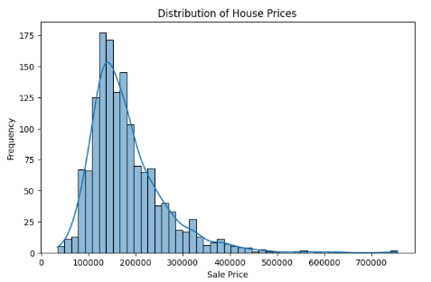
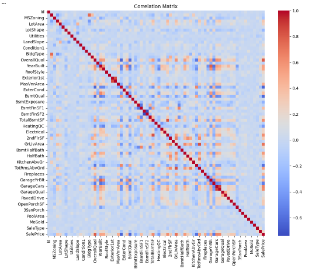
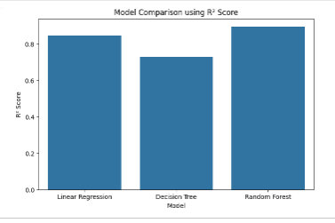
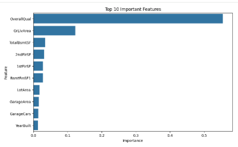
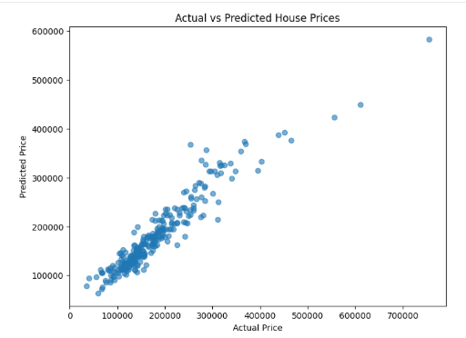

# 🏠 House Price Prediction using Machine Learning

## 📌 Project Overview

This project predicts house prices using Machine Learning based on various property features such as overall quality, living area, garage size, number of rooms, and other housing characteristics.

The project demonstrates the complete machine learning workflow including data preprocessing, exploratory data analysis (EDA), feature engineering, model training, evaluation, and model saving.

---

## 📂 Dataset

- Dataset: House Prices - Advanced Regression Techniques
- Source: Kaggle

---

## 🚀 Technologies Used

- Python
- Pandas
- NumPy
- Matplotlib
- Seaborn
- Scikit-learn
- Joblib

---

## 📊 Project Workflow

- Import Libraries
- Load Dataset
- Data Exploration
- Missing Value Analysis
- Data Cleaning
- Label Encoding
- Exploratory Data Analysis (EDA)
- Feature Engineering
- Train-Test Split
- Model Training
- Model Evaluation
- Feature Importance
- Save Best Model

---

## 🤖 Machine Learning Models

- Linear Regression
- Decision Tree Regressor
- Random Forest Regressor

---

## 📈 Evaluation Metrics

- Mean Absolute Error (MAE)
- Mean Squared Error (MSE)
- Root Mean Squared Error (RMSE)
- R² Score

---

---

## 📁 Project Structure

```text
House-Price-Prediction/
│
├── House_Price_Prediction.ipynb
├── train.csv
├── house_price_model.pkl
├── requirements.txt
├── .gitignore
├── README.md
└── images/
```
# 📷 Project Screenshots

## House Price Distribution



---

## Correlation Matrix



---

## Model Comparison



---

## Top 10 Feature Importance



---

## Actual vs Predicted Values


---

## 🎯 Conclusion

This project demonstrates an end-to-end regression workflow using machine learning. After comparing multiple regression algorithms, the Random Forest Regressor provided the best predictive performance for house price estimation.

---

## 👩‍💻 Author

**Bushra Naseem**

GitHub: https://github.com/bushranaseem1

LinkedIn: https://www.linkedin.com/in/bushra-naseem-b31776333/
